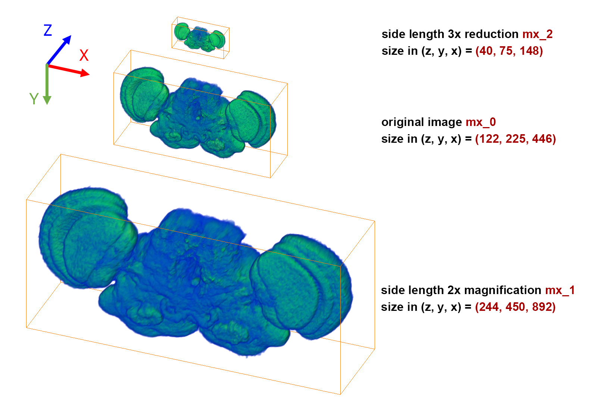
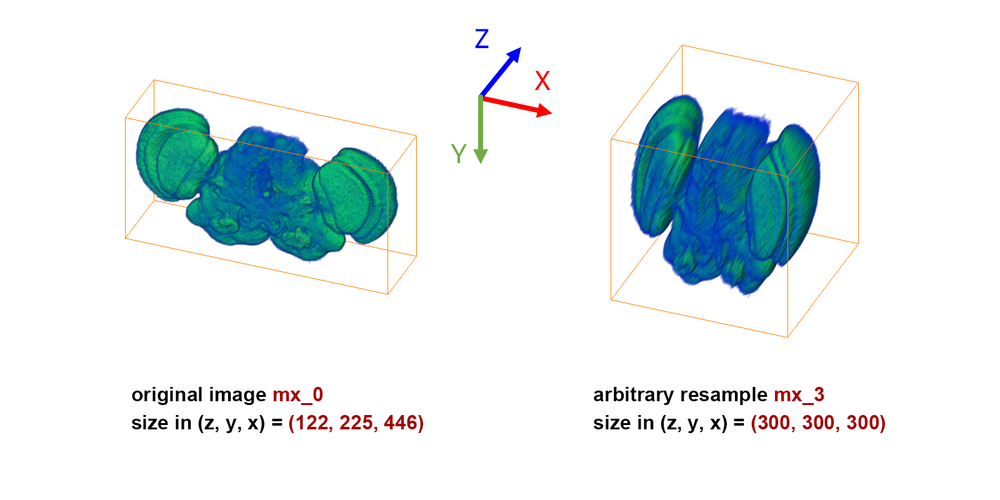

# ResampleRGI3D

ResampleRGI3D is a python function that can help you easily resample a 3D array to the size you want, which is based on the combination of [`scipy.interpolate.RegularGridInterpolator`](https://docs.scipy.org/doc/scipy/reference/generated/scipy.interpolate.RegularGridInterpolator.html) and [`numpy.meshgrid`](https://numpy.org/doc/stable/reference/generated/numpy.meshgrid.html). 

## How to use
You can easily import the script `ResampleRGI3D.py` as a module by key in
> `from ResampleRGI3D import ResampleRGI3D` 
 
or just copy-paste the content of `ResampleRGI3D` into your own python script.

## Function: ResampleRGI3D

`ResampleRGI3D(input_mx, resize_to, dtype='float64')`

| argument | type | description |
| - | - | - |
| input_mx | numpy array | The array you want to resize. |
| resize_to | tuple, list, or numpy array | The size you want the array resize to. Same dimension as input_mx. |
| dtype | - | Input the dtype you want. |

Returns: Resampled input_mx with size same as resize_to given.

## Example

Firstly, we load a numpy array as mx_0.

```
from ResampleRGI3D import ResampleRGI3D

mx_0 = np.load('somesamplefile.npy')
print(np.shape(mx_0))  # (122, 225, 446)
```

Resample mx_0 into shapes we want. You can independently resize 3 dimensions with different magnification.

```
mx_1 = ResampleRGI3D(mx_0, (244, 450, 892))
mx_2 = ResampleRGI3D(mx_0, (40, 75, 148))
mx_3 = ResampleRGI3D(mx_0, (300, 300, 300))

print(np.shape(mx_1))  # (244, 450, 892)
print(np.shape(mx_2))  # (40, 75, 148)
print(np.shape(mx_3))  # (300, 300, 300)
```

3D image samples as below. The Drosophila brain 3D image comes from [FlyCircuit](https://www.flycircuit.tw/).




## Note
You may found that there is a function called [`scipy.ndimage.zoom`](https://docs.scipy.org/doc/scipy/reference/generated/scipy.ndimage.zoom.html) in `SciPy` does the same thing with more precise settings and parameters. Yes, in fact, ResampleRGI3D is just a piece of work came from my ignorance in my early days of learning python. But it's still an important tool in my career work though, so I decided to github it for a kind of memorial.
